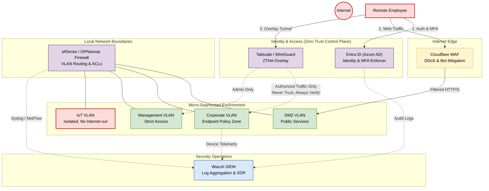

  <h1>Zero Trust Network Architecture for SMB</h1>
  
  

    
    
  

A comprehensive, production-inspired repository demonstrating how to implement a Zero Trust Network Architecture (ZTNA) for a Small-to-Medium Business (SMB). This project is designed as a portfolio piece to showcase real enterprise-grade security thinking, focusing on the principle of **"Never Trust, Always Verify."**

## 🎯 Project Goals
- **Eliminate the Traditional Perimeter:** Shift from a "trusted internal network" model to micro-segmentation and identity-driven access.
- **Enforce Least Privilege:** Use strict ACLs and Conditional Access to ensure users and devices only access what they explicitly need.
- **Assume Breach:** Design the architecture under the assumption that threat actors may already be inside the network.
- **Continuous Monitoring:** Ensure every authentication request and network flow is logged and analyzed for anomalous behavior.

## 🏗️ Architecture Overview

The architecture is divided into distinct zones, enforcing strict boundaries at every layer. 
We leverage open-source or affordable solutions that an SMB can realistically deploy.

### High-Level Topology

*(If the Mermaid diagram above does not render, please view the [Architecture Diagram Image](docs/diagrams/zero-trust-architecture.png))*

## 🛠️ Technology Stack
- **Internet Edge:** Cloudflare (WAF, DDoS Protection, Bot Management)
- **Firewall & Routing:** pfSense / OPNsense (VLAN Segmentation, L4/L7 Filtering)
- **Identity Provider (IdP):** Entra ID / Azure AD (SSO, Conditional Access, MFA)
- **Zero Trust Network Access (ZTNA):** Tailscale (WireGuard-based Overlay, Micro-segmentation)
- **Security Operations (SIEM/XDR):** Wazuh (Log Aggregation, FIM, Endpoint Telemetry)

## 📂 Repository Structure

- [`docs/`](docs/) - Core architectural documentation.
  - [Architecture Deep Dive](docs/ARCHITECTURE.md)
  - [Threat Model](docs/THREAT-MODEL.md)
  - [Implementation Guide](docs/IMPLEMENTATION-GUIDE.md)
- [`configs/`](configs/) - Configuration templates demonstrating least privilege.
  - `network/` - pfSense VLAN templates
  - `identity/` - Entra ID Conditional Access JSON exports
  - `vpn/` - Tailscale ACL policies
- [`scripts/`](scripts/) - Automation and deployment scripts.
  - `deploy_wazuh_agent.sh` - Secure agent deployment.
  - `trust_zone_health_check.py` - Auditing script to verify network isolation.

## 🚀 Getting Started

If you want to review the thought process behind this architecture:
1. Start with [ARCHITECTURE.md](docs/ARCHITECTURE.md) to understand the design decisions.
2. Review [THREAT-MODEL.md](docs/THREAT-MODEL.md) to see how we defend against specific attack vectors.
3. Dive into the `configs/` and `scripts/` directories to see how the concepts are applied practically.
4. Read [IMPLEMENTATION-GUIDE.md](docs/IMPLEMENTATION-GUIDE.md) if you want to deploy this in a home lab or small business setting.